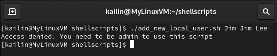
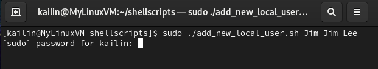
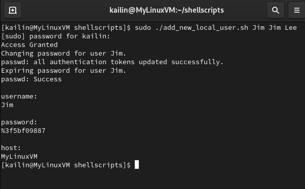
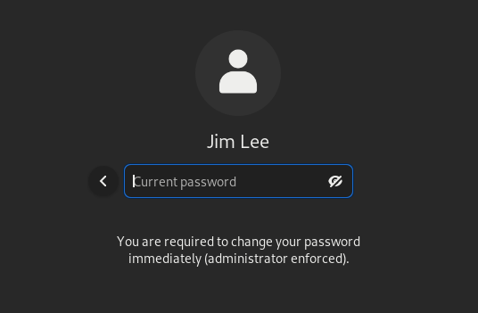
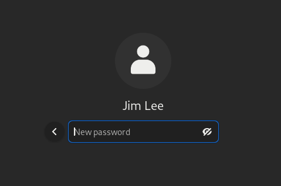

# Add New Local User – Bash Script

This bash script automates the process of adding a new local user to a Linux system. I created it as a hands-on exercise to practice bash scripting and automate user account creation while following security best practices.

---
## 📚 Table of Contents
- [Features](#features)
- [Script Execution Flow](#script-execution-flow)
  - [Non-admin attempt](#1-non-admin-attempt)
  - [Running the script with sudo](#2-running-the-script-with-sudo)
  - [Script Actions](#3-script-actions)
  - [User Login](#4-user-login)
  - [Forced Password Reset](#5-forced-password-reset)
  - [Successful Login](#6-successful-login)
- [Techniques Used](#techniques-used)

---
## 📌 Features

- ✅ Adds a new user to the local Linux system  
- 🔐 Automatically generates a secure, random password  
- 🧾 Outputs the username, password, and hostname to the console for documentation  
- 🔄 Enforces password change upon first login (administrator enforced)

---

## 💻 Script Execution Flow

### 1. ❌ Non-admin attempt

Running the script without administrator privileges results in an error:



---

### 2. ✅ Running the script with `sudo`

The script accepts:
- First argument: desired username
- Remaining arguments: comment (e.g., full name)

```bash
sudo ./add_new_local_user.sh Jim "Jim Lee"
```


---

### 3. ⚙️ Script Actions
When access is granted, the script will do the following:
1. Adds the user
2. Sets a random password
3. Displays the account credentials and hostname



---

### 4. 👤 User Login
After the new user is created, they can log into the system.


---

### 5. 🔑 Forced Password Reset
The user will be prompt to changed their password immdediately upon first login.




---

### 6. ✅ Successful Login
Once the password is reset, the user will be logged into the system.


---

## 🧪 Technique Used
Secure password generation using:
  - Current timestamp
  - sha256sum hashing
  - Special character insertion
  - Random shuffling with fold, head, tr

Conditional checks:
  - Script ensures it’s run as root
  - Verifies success after each critical step
  - Aborts immediately on failure to protect system integrity

