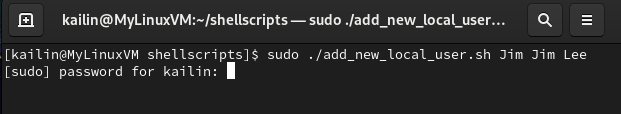
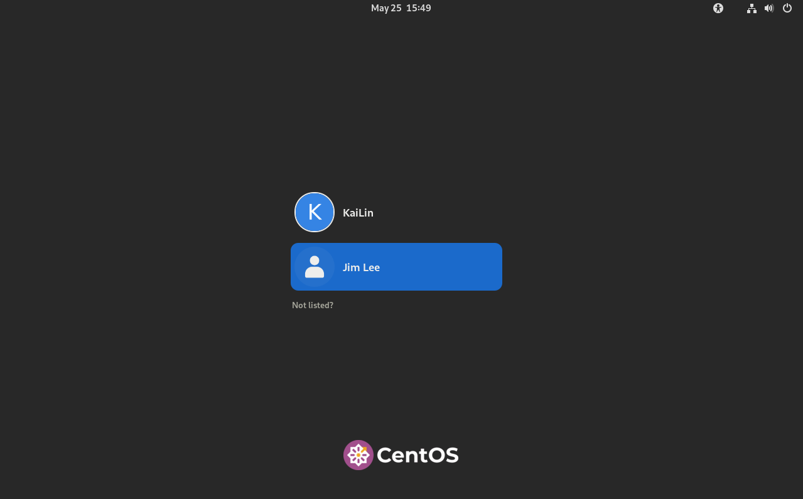

📘 [English](README.md) | 📙 [中文](README_zh.md)

# 👤 新增本地使用者 – Bash腳本

這個Bash腳本可自動化在Linux系統中新增本地使用者的流程。我撰寫這個腳本是為了實作練習，透過Bash腳本來自動建立新使用者帳號，並遵循資訊安全的最佳實務。

---
## 📝 功能特色

- 在本機Linux系統中新增使用者帳號  
- 自動產生11字元長度的安全隨機密碼  
- 輸出使用者名稱，密碼與主機名稱，方便記錄管理  
- 強制使用者在首次登入時更改密碼  

---
## 📜 腳本内容

```bash 
#!/bin/bash
#
# Created by Kai-Lin Chuang
#
# This script creates a new user on the local system
# You must supply a username as an argument to the script
# Any argument after the username argument will be count as a comment
# A password will be generated for the account
# The username, password and host of the account will be displayed at the end

# Check if script is executed with superuser privileges
if [[ "${UID}" -ne 0 ]]
then 
	echo 'Access denied. You need to be admin to use this script'
	exit 1
else
	echo 'Access Granted'
fi

#  If the user doesn't supply at least one argument, then give them help
if [[ "${#}" -lt 1 ]]
then
	echo 'Please type the username you want to use for this script'
	echo "Example: ${0} USERNAME [COMMENT]..."
	exit 1
fi

# The first parameter is the user name
USER_NAME="${1}"

# The rest of the parameters are for the account comments
shift
COMMENT="${@}" 

# Generate a random password
SP_CHARACTER=$(echo '!@#$%^&*()_+-=' | fold -w1 | shuf | head -c1)
PASSWORD=$(date +%s%N${RANDOM} | sha256sum | head -c10)
PASSWORD_ENHANCED=$(echo "${PASSWORD}${SP_CHARACTER}" | fold -w1 | shuf | tr -d '\n' )

# Create the user with the password
useradd -c "${COMMENT}" -m ${USER_NAME}

# Check to see if the useradd command succeeded
if [[ "${?}" -ne 0 ]]
then 
	echo 'The account could not be created'
	exit 1
fi

# Set the password
echo ${PASSWORD_ENHANCED} | passwd --stdin ${USER_NAME}

# Check to see if the passwd command succeeded
if [[ "${?}" -ne 0 ]]
then
	echo 'The password for the account could not be created'
	exit 1
fi

# Force password change on first login
passwd -e ${USER_NAME}

# Display the username, password and the host where the user was created
echo
echo 'username:'
echo "${USER_NAME}"
echo
echo 'password:'
echo "${PASSWORD_ENHANCED}"
echo
echo 'host:'
echo "${HOSTNAME}"
exit 0
```
---

## ⌨️ 腳本執行流程

### 1. 非管理員執行

若未使用管理員權限執行腳本，將出現錯誤提示：


---

### 2. 使用`sudo`執行

腳本接受以下參數：
- 第一個參數：欲建立的使用者名稱  
- 後續參數：帳號的註解資訊（如使用者姓名）

```bash
sudo ./add_new_local_user.sh Jim "Jim Lee"
```


---

### 3. 腳本操作內容

當授權成功後，腳本將會：
1. 新增使用者帳號
2. 設定隨機密碼
3. 顯示使用者帳號、密碼與主機名稱


---

### 4. 使用者登入

帳號建立完成後，使用者可使用預設密碼登入系統：



---

### 5. 強制更改密碼

使用者首次登入後，系統會立即要求變更密碼：


---

### 6. 成功登入

密碼變更成功後，使用者即可登入系統：


---

## 🧪 使用技術

密碼安全產生方式：
  - 利用目前時間戳記產生基礎隨機值
  - 使用sha256sum進行雜湊處理
  - 插入隨機特殊符號
  - 搭配fold，head，tr指令進行隨機打亂

條件判斷與錯誤處理：
  - 確保腳本必須以root身分執行
  - 每個重要步驟皆會進行成功檢查
  - 一旦發現錯誤，立即中止腳本以保障系統穩定性

---

## 📙 結論

這個專案讓我透過實作深入學習了Linux使用者管理，條件判斷邏輯與安全密碼產生的技巧。我撰寫這個腳本是為了自動化一項常見的系統管理任務，同時強化如強制更改密碼與步驟成功驗證等資訊安全實務。

透過這次的練習，我對於使用Bash解決實務系統管理問題更加有信心，也提升了撰寫穩定且易於使用的自動化腳本能力，為未來更進階的自動化任務做好準備。

